# Understand ways to block vulnerable code before it reaches production

Now that GHAS has been enabled at your repository, let's protect your codebase and main branch from so vulnerable code will not reach your production environment.

### Prerequisites

  
See details

  
1. Make sure you have enabled the `Dependency graph` and `Dependabot alerts` on your repository. If you haven't done this yet, please follow the steps which you can find in the [Task 1: Enable Dependabot](./1-understand-how-to-configure-github-advanced-security-for-a-repository.md#task-1-enable-dependabot) guide from the [Understand how to configure GitHub Advanced Security for a repository](1-understand-how-to-configure-github-advanced-security-for-a-repository.md) exercise.

2. Make sure you have added the `dependency-review` workflow to your repository. If you haven't done this yet, please follow the steps which you can find in the [Add a Pull Request Dependency Review Action](./1-understand-how-to-configure-github-advanced-security-for-a-repository.md#add-a-pull-request-dependency-review-action) guide from the [Understand how to configure GitHub Advanced Security for a repository](1-understand-how-to-configure-github-advanced-security-for-a-repository.md) exercise.

--------

First, access your Organization homepage by following the URL that has been provided to you together with your user credentials. You should see two repositories - pick any one of them and click on it.

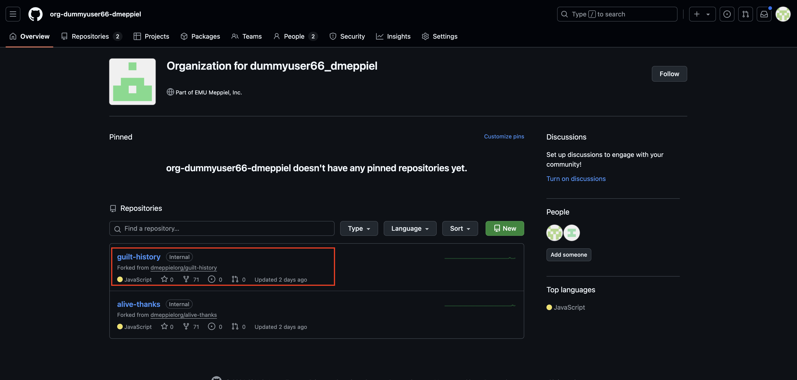

## Task 1: Configure a Repository Branch Ruleset
* A [GitHub Rulesets](https://docs.github.com/en/repositories/configuring-branches-and-merges-in-your-repository/managing-rulesets/about-rulesets) is a named list of rules that apply to a repository. You can create rulesets to control how people can interact with selected branches, tags and have some control on what can be pushed into your a repository, regarding filetypes, sizes etc.
* For this task, we'll create a branch ruleset, give it a meaningful name, enable it, apply on default branch and configure it for using the Default Code scanning to pass and other checks.

To create a Ruleset, go to the Repository Settings and navigate to the Rules section. 

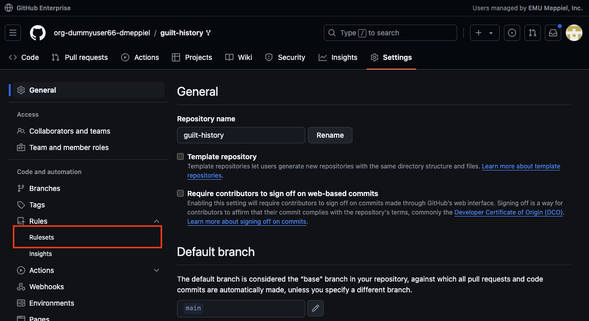

Here you'll find the overview of all configured rules and you want to add a `New branch ruleset`

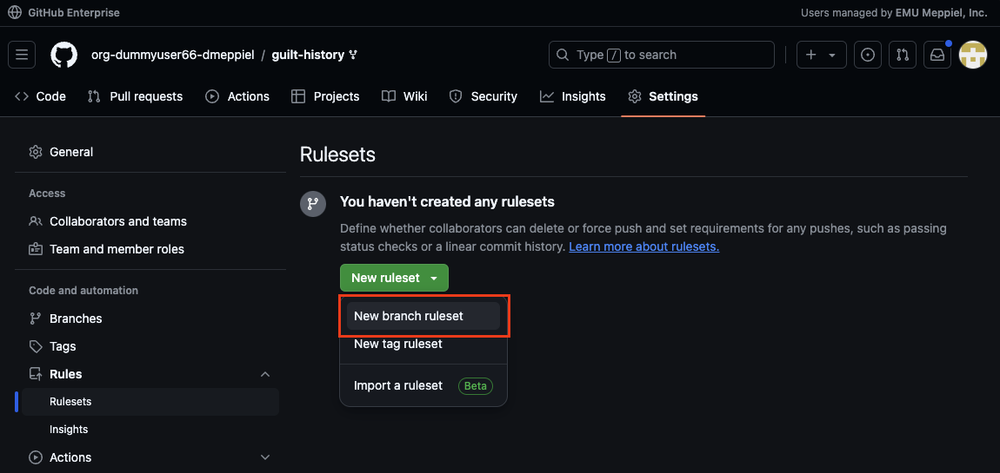

1. Give it a name of your choice, such as `Block PRs with new vulnerabilities`. Set the enforcement status to `Active` (after saving it will be effective immidiatly).
2. We want to make sure to target only the default branch of your repository, so click on `Add target` and select `Include default branch`.

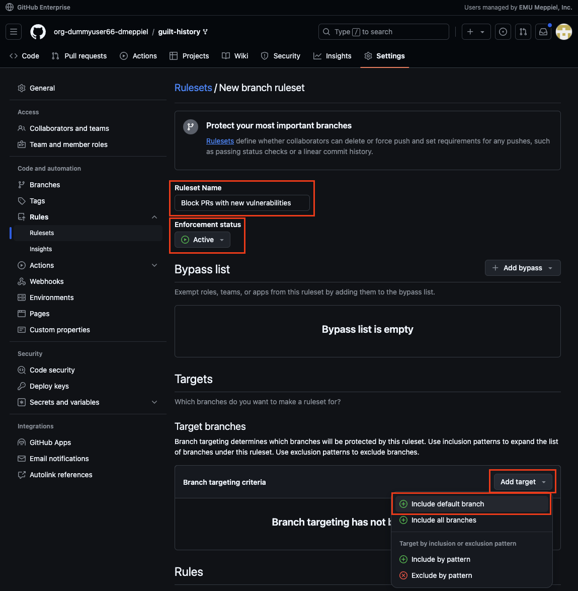

--------

Add or update the `Rules` section with the following options:
- `Require a pull request before merging`
  - No additional configuration needed

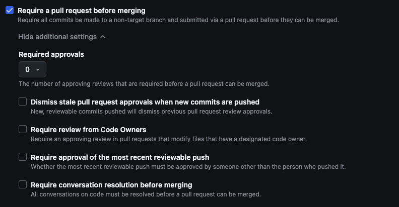

--------

- `Require status checks to pass`
  - Press the `Add checks` button
  - Type in `dependency-review` and and check the available option

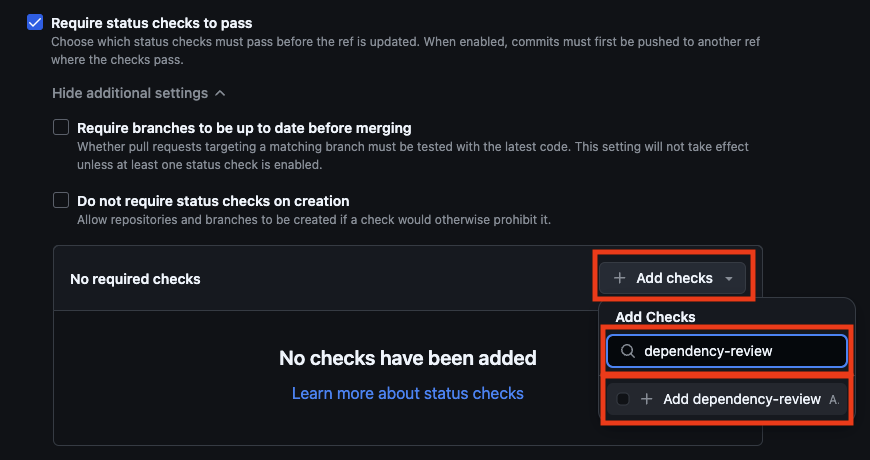

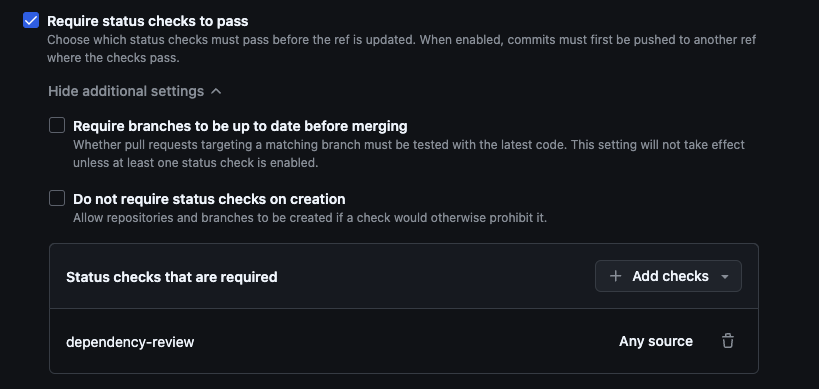

--------

- `Require code scanning results`
  - No additional configuration needed

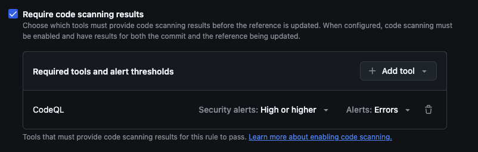

### Branch protection ruleset in action
Navigate back to your repository and create a pull request. As we have added a ruleset to make sure the code is checked and safe. GitHub will automatically start building scanning your code when you create a pull request and enforces that you can't merge the pull request before the found vulnerability is fixed.

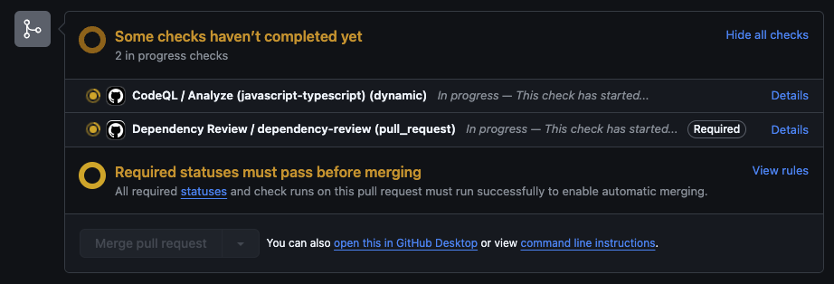

**Note:** Watch the `Dependency Review / dependency-revew` marked as a **Required** check here.

Resulting in actionable notifications and will block merging the suggested - vulnerable - changes to the `main` branch - all good to go now 🚀.

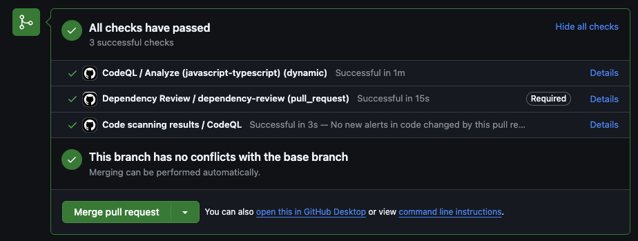

## Task 2: Secret Push Protection
To enable Secret Push Protection, simply go to `Settings` on your repository and under `Code security and analysis`, you'll find a section `Secret scanning`.

Find the `Push protection` option and click the `Enable` button here.

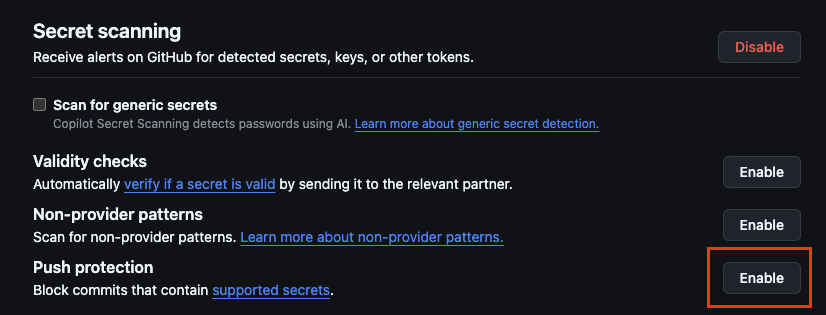

**Congratulations**, you've enabled Secret Scanning Push Protection to your repository!

## Outcomes achieved in this exercise
**1. Repository branch ruleset**
- Protect the `main` branch
- Require a Pull Request  before merging
- Require succesfull `Status Checks`
- Require successfull `Code Scanning` results
  - No vulnerabilities

**2. Enabled Secret Push Protection**
