# Discover how to scale GitHub Advanced Security setup and policies for thousands of repositories


## Task 1: Apply GitHub's recommended Security Configuration
We will establish GitHub's recommended settings for Code Security as a baseline for any existing and future repositories in your Organization. This will ensure that Dependabot, Code Scanning and Secret Scanning are enabled and configured following GitHub's recommended settings. 

Navigate to your Organization's settings and under the `Code Security` section click on `Configurations`. Click the edit icon on the `GitHub recommended` configuration.

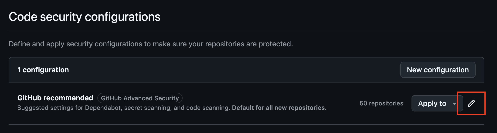

Now ensure that this becomes the default configuration for all future new repositories. Scroll down to the `Policy` section and under `Use as default for newly created repositories` choose `All repositories`. Then click on `Save configuration`.

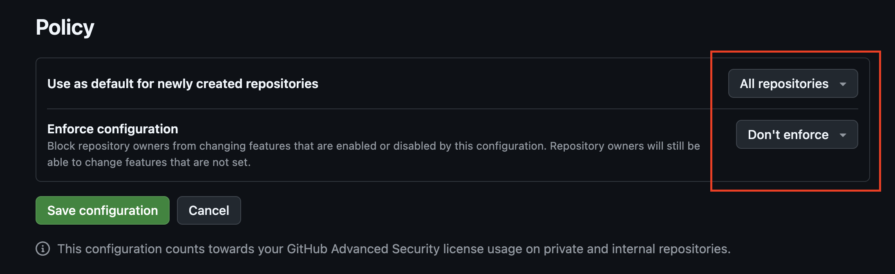

Let's also secure your existing repositories if any by applying this configuration to all of them. Navigate back to `Configurations` and under `GitHub recommended` click on `Apply to`, then chose `All repositories`. 

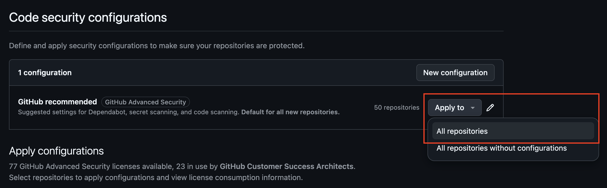

Your existing repositories and any new future repositories in the Organization are now protected with a baseline configuration!

## Task 2: Create custom repository properties

Not all of your repositories may require the same set of code security configurations. Let's imagine you have a group of repositories that contain the code for business-critical production web applications that are exposed to the public Internet. You may want to apply a different configuration to them. Let's first label them with custom Repository Properties.

Under `Custom properties` on the Organization's settings left sidebar, click on `New property`. 

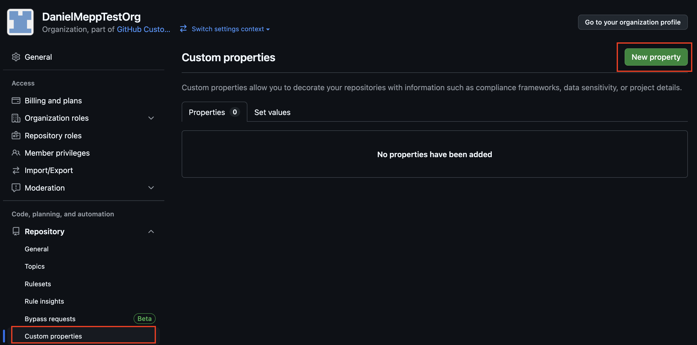

Fill in the form as follows and click on `Save property` once you are ready. Note that we are creating a `boolean` property and enforcing it to be set for all repositories with a default value set to `false`.

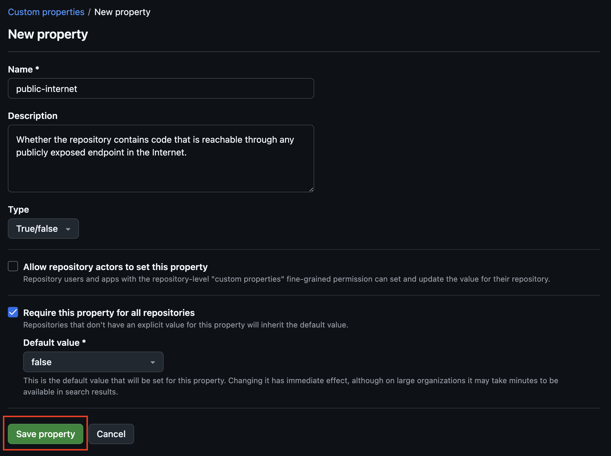

Now let's choose a couple of repositories and navigate to edit their properties' values. 

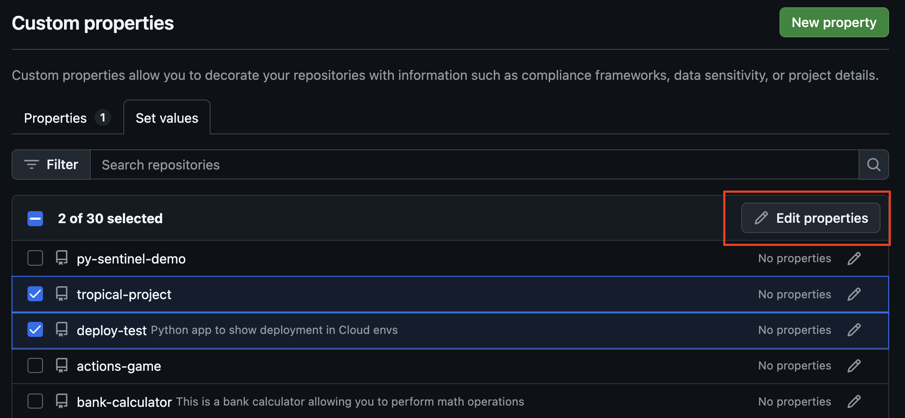

Now set the `public-internet` custom property to `True` and click on `Save`. 

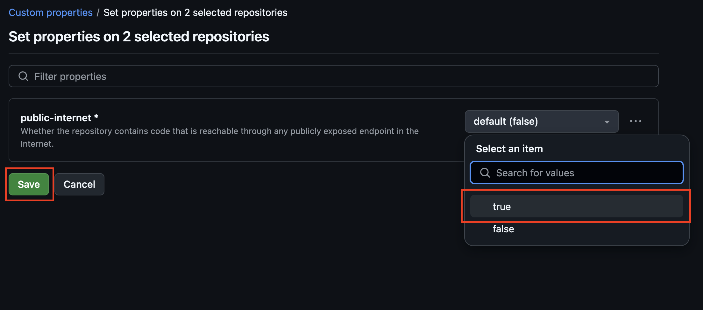

## Task 3: Set up a custom Security Configuration
Navigate back to the Code Security `Configurations` of your Organization and click on `New configuration`. 

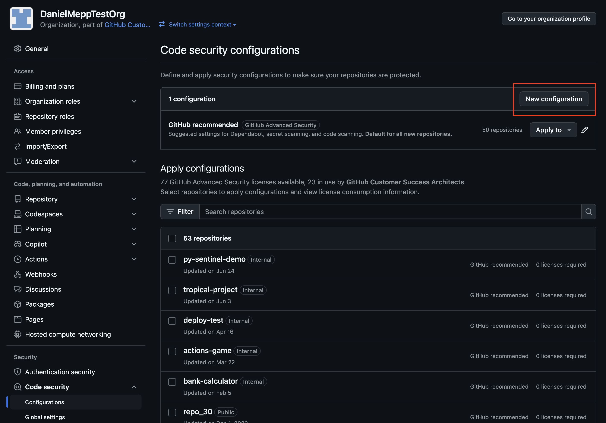

Give it a name and a description of your choice, such as `Strict full enablement`. Make sure to select `Enable` on all the settings and set `Enforce` under the Policy settings, then click on `Save configuration`.

## Task 4: Apply your Custom Security Configuration to a subset of Repos

Under `Apply configurations` enter the following filter query:

```props.public-internet:true```

Then select both repositories that show up and apply the `Strict full enablement` security configuration.

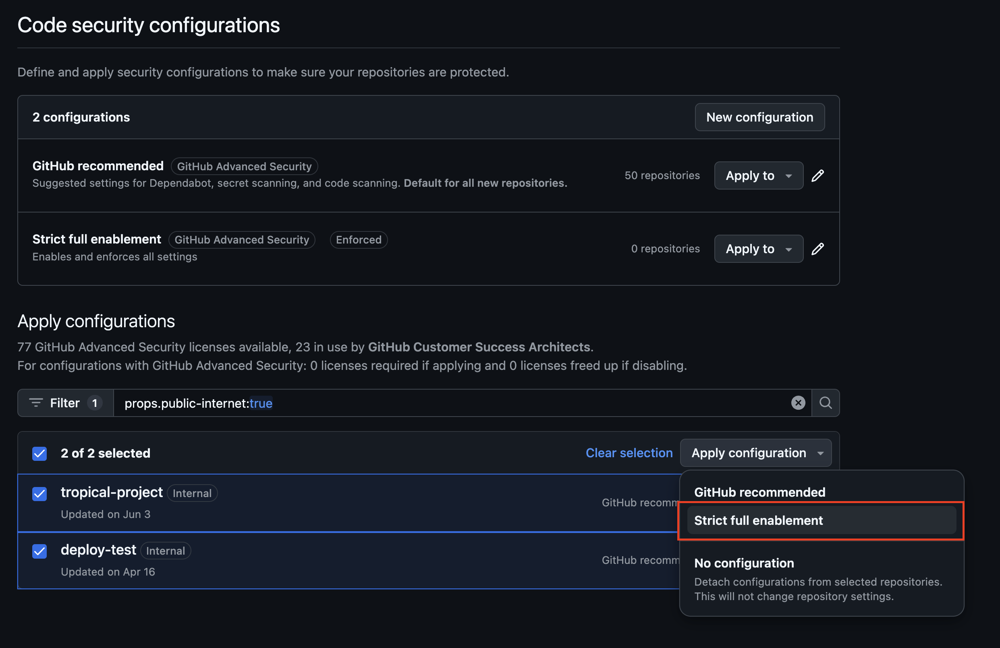

## Task 5: Block PRs introducing vulnerabilities

With all the Organization repositories now raising alerts on dependencies, code vulnerabilities and leaked secrets, we can now go a step beyond and block new security vulnerabilities from being merged in production. That's proper shift-left security!

> **Note:** Remember that Secrets are already being blocked on push thanks to Push Protection, which is configured on your Security Configurations. 

Let's create a new Organization Ruleset that will block Pull Requests that introduce new vulnerabilities, whether they're coming from the code you wrote or newly introduced dependencies. 

Navigate to the `Rulesets` settings of your Organization and click on `New ruleset`, then `New branch ruleset`. 

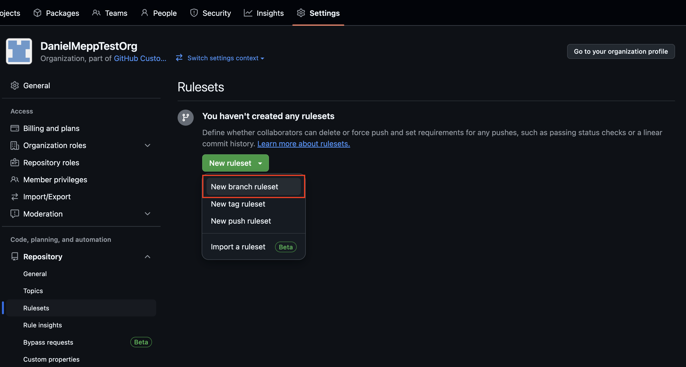

Give it a name of your choice, such as `Block PRs with new vulnerabilities`. Set the enforcement status to `Active`, and target repositories by `Dynamic list property`. We will target repositories that have the `public-internet` property set to `true`, simply to illustrate how rulesets can be enforced granularly. 

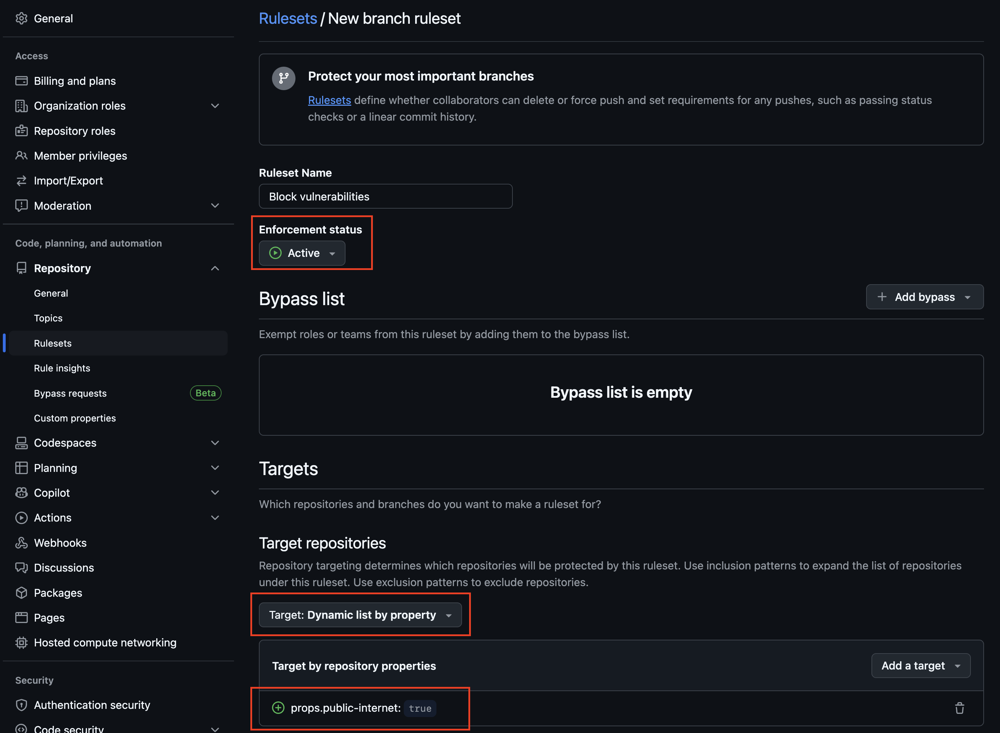

We want to make sure to target only the default branch of the repositories, so click on `Add target` and select `Default branch`.

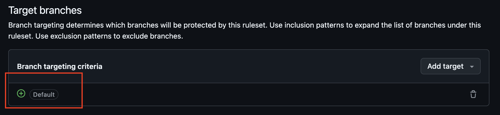

Let's set up the rules that this Ruleset will apply:

- We will require pull requests before merging into the Default branch. Simply click the checkbox `Require pull request before merging` and you are done!
- We will require that the `CodeQL` tool provides satisfactory code scanning results. Check the checkbox `Require code scanning results` and set the `Code scanning tool` to `CodeQL` and the `Security alerts` threshold to `High or higher`.
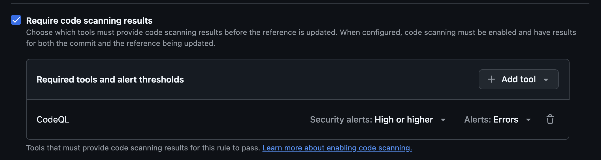
- We will require that the `Dependency review` workflow passes. Check the checkbox `Require workflows to pass before merging` and add the workflow `dependency-review.yml` that you created in the first exercise of this workshop.
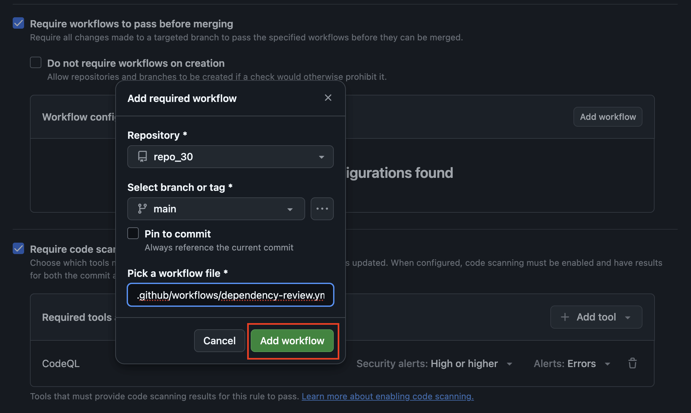

Click on `Create` and your new Organizational Ruleset will make sure that no new vulnerabilities are introduced in the default branches of your most critical repositories!

## Outcomes achieved in this exercise
**1. Code security configurations**
- Applied GitHub’ recommended to be used as the default on new  and existing repositories

**2. Repository custom properties**
- Created and applied to classify a repository and/or a group of repositories

**3. Organization ruleset**
- Created and applied an organization ruleset to enforce checks standards to a classified set of repositories through repository custom properties
